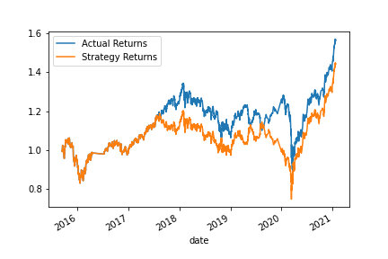

# 15_Module_13_hw

## Module 14 Challenge: Algorithmic trading

### Baseline

- The baseline model was trained using the following parameters:

  - support vector machine (SVM)
  - SMA - short (4), long (100)
  - traning window: 3 months

- The performance of the baseline model is as below:
  - classification report:
  - 
  - return:
  - 

### Analysis

1. The training window was increased to 18 months. Answer the following question: What impact resulted from increasing or decreasing the training window?

   - The performance of the new model is as below:
     - classification report:
     - 
     - return:
     - 
   - Anlysis:
     - There is significant increase in the precision of the model, i.e. increase ability to predict both long (1) and short (-1) trading opportunities.
     - However, both models have very low recall (0.04 and 0.00) while predicting short (-1) opportunities. The new model with low recall and high precision means it returns very few (-1) results, but most of its predicted labels are correct when compared to the training labels.

2. The SMA input features was changed to short (50), long (200), which is a very well known trading strategy. Answer the following question: What impact resulted from increasing or decreasing either or both of the SMA windows?

   - The performance of the new model is as below:
     - classification report:
     - 
     - return:
     - 
   - Anlysis:
     - There is a slight increase in the precision of the model, i.e. increase ability to predict both long (1) and short (-1) trading opportunities.
     - There is improve in ability to identify short (-1) opportunities. The higher recall score indicates the model identify a lot short opportunities when compared to the training labels.
     - There is lower recall score for identify long (1) opportunities. The lower recall score indicates the model identify less long opportunities when compared to the training labels.

3. Best strategy:
   - There isn't the best strategy. It depends on the investment mandate of the fund to pick the appropreate strategy.
   - With long-only fund, model 2, with longer training window, picks up all the long opportunities.
   - With short-only fund, model 3 produces higher recall, meaning more short opportunities.
